<h3><code>Emir2M@github ~ $ ./contributions.sh</code></h3>

 

<h3><code>Emir2M@github ~ $ whoami</code></h3>
<table>
  <tr>
    <td valign="top"></td>
    <td valign="top"></td>
  </tr>
</table>

 

<a href="https://www.linkedin.com/in/emirhan-y%C4%B1ld%C4%B1r%C4%B1m-0b85b8301/"><code>LinkedIn</code></a>  <a href="https://randevumcepte.shop"><code>randevumcepte.shop</code></a>  <a href="mailto:emirhany493@gmail.com"><code>emirhany493@gmail.com</code></a>

 

<code>Emir2M@github ~ $ exit</code>

